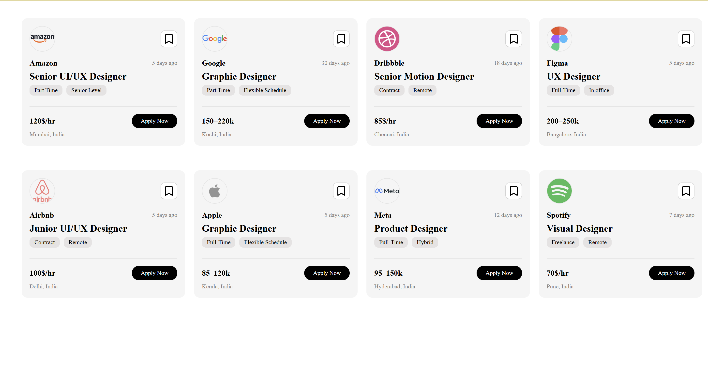

# Job Cards UI – React Project

A responsive job listing card interface built using **React**, **CSS Grid**, and **Flexbox**.  
This project recreates a clean, modern job-card UI similar to professional job portals.

---

## 🚀 Features

### ✅ Responsive card layout
- Cards automatically adjust to screen size (1, 2, 3, or 4 per row).
- Achieved using **CSS Grid** with:

### ✅ Reusable Card Component
Each card is fully dynamic and receives props such as:
- `company`
- `logo`
- `posted`
- `title`
- `tags`
- `pay`
- `location`

### ✅ Clean UI Styling
- Flexbox-based internal layout for precise alignment.
- Circular company logos.
- Rounded tag pills.
- Smooth spacing, divider lines, and hierarchy.

### ✅ External Data Mapping
Job data is stored in a separate `jobs.js` file and imported into `App.jsx`, then rendered using:
```jsx
{jobs.map(job => <Card {...job} />)}

src/
│── Components/
│    └── Card.jsx
│── cards.css
│── jobs.js          // Job data array
│── App.jsx
│── main.jsx

## 📸 Screenshots
- 
